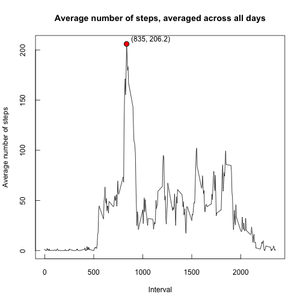
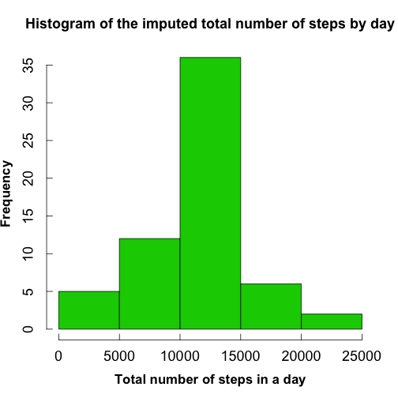

<!-- rmarkdown v1 -->

Peer Graded Assignment: Course Project 1
------------------------------------------
*Arman Kirakosyan*  
---------------
*July 5, 2016*  
----------
<!-- output: html_document -->


---

## Introduction  

It is now possible to collect a large amount of data about personal movement using activity monitoring devices such as a [Fitbit](www.fitbit.com), [Nike Fuelband](http://www.nike.com/us/en_us/c/nikeplus-fuelband), or [Jawbone Up](https://jawbone.com/up). These type of devices are part of the “quantified self” movement – a group of enthusiasts who take measurements about themselves regularly to improve their health, to find patterns in their behavior, or because they are tech geeks. But these data remain under-utilized both because the raw data are hard to obtain and there is a lack of statistical methods and software for processing and interpreting the data.  

This assignment makes use of data from a personal activity monitoring device. This device collects data at 5 minute intervals through out the day. The data consists of two months of data from an anonymous individual collected during the months of October and November, 2012 and include the number of steps taken in 5 minute intervals each day.  

## Loading and preprocessing the data


### Load neccesary libraries


```r
library(dplyr)
library(lattice)
library(ggplot2)
library(plotrix)
```

### Download the data


```r
fileurl <- "https://d396qusza40orc.cloudfront.net/repdata%2Fdata%2Factivity.zip"
f <- file.path(getwd(),  "activity.zip")
download.file(fileurl, f, method = "curl")
```

### Unzip the data

```r
unzip(zipfile = f, exdir = ".")

## Path to the dataset
path <- file.path(getwd())
```

### Read the dataset

```r
a <- tbl_df(read.csv(file.path(path, "activity.csv")))
```

### Take a peek at data

```r
str(a)
```

```
## Classes 'tbl_df', 'tbl' and 'data.frame':	17568 obs. of  3 variables:
##  $ steps   : int  NA NA NA NA NA NA NA NA NA NA ...
##  $ date    : Factor w/ 61 levels "2012-10-01","2012-10-02",..: 1 1 1 1 1 1 1 1 1 1 ...
##  $ interval: int  0 5 10 15 20 25 30 35 40 45 ...
```


## What is mean total number of steps taken per day?

```r
## For this part of the assignment, missing values in the dataset will be ignored.
a1 <- a[complete.cases(a),]

## Take a peek at data with NAs ignored
str(a1)
```

```
## Classes 'tbl_df' and 'data.frame':	15264 obs. of  3 variables:
##  $ steps   : int  0 0 0 0 0 0 0 0 0 0 ...
##  $ date    : Factor w/ 61 levels "2012-10-01","2012-10-02",..: 2 2 2 2 2 2 2 2 2 2 ...
##  $ interval: int  0 5 10 15 20 25 30 35 40 45 ...
```

```r
## Aggregate total number of steps by day
total_steps <- aggregate(a1$steps, by=list(a1$date), FUN = sum)

## Give columns appropriate names
colnames(total_steps) <- c("date", "steps")

## Histogram of the total number of steps taken each day
hist(total_steps$steps, col=4, main = "Histogram of the total number of steps by day", 
     xlab = "Total number of steps in a day", 
        tck = 0.02, cex.axis = 1.5, cex.lab = 1.4, 
            cex.main = 1.5, font.lab = 2)

## The mean and median of the total number of steps taken per day
mean(total_steps$steps)
```

```
## [1] 10766.19
```

```r
median(total_steps$steps)
```

```
## [1] 10765
```

```r
## Vertical red line on histogram showing the position of mean of the total number of 
## steps taken per day
abline(v=mean(total_steps$steps), col = "red", lwd = 4)
```


## What is the average daily activity pattern?


```r
## Make a time series plot (i.e. type = "l") of the 5-minute interval 
## (x-axis) and the average number of steps taken, averaged across all days (y-axis)

## Aggregate avearge number of steps by 5-minute interval accross all days
steps_ave_interv <-aggregate(a1$steps, by=list(a1$interval ), FUN = mean)

## Give columns appropriate names
colnames(steps_ave_interv) <- c("interval", "steps")

## Time series plot
plot(steps_ave_interv$interval,steps_ave_interv$steps, type = "l", main = 
    "Average number of steps, averaged across all days", 
            xlab = "Interval", ylab = "Average number of steps", tck = 0.02)

## 5-minute interval, on average across all the days in the dataset, containing 
## the maximum number of steps
maxstep <- which.max(steps_ave_interv$steps)

## subset corresponding to the maximum number of steps
steps_ave_interv[maxstep, ]
```

```
##     interval    steps
## 104      835 206.1698
```

```r
## Legend with the position of maximum number of steps 
legend(x=750, y=220, "(835, 206.2)", bty = "n")
draw.circle(835,206,25, col = "red")
```



## Imputing missing values

**Total number of missing values, total number of rows with NAs**

```r
## Total number of missing values in the dataset (i.e. the total number of rows with NAs)
sum(is.na(a))
```

```
## [1] 2304
```

```r
## Total number of rows with NAs can also be found by substracting 
## nrow(original dataset) - nrow(dataset with ignored NAs)
nrow(a)-nrow(a1)
```

```
## [1] 2304
```

**Missing-data imputation**

```r
## Extracting part of dataset with missing values
a_na <- a[is.na(a$steps), ]

## Imputing missing values in a_na by filling NAs with mean for that 5-minute interval
for (i in 1:nrow(a_na)){
    interval1 <- a_na$interval[i]
        row_n <- which(steps_ave_interv$interval == interval1)
            steps1 <- steps_ave_interv$steps[row_n]
                a_na$steps[i] <- steps1
                    }

## Creation of a new dataset equal to the original dataset but with the missing data filled in
## Row binding of a_na with a1, the dataset with ignored NAs values
a_imp <- rbind(a_na,a1)

## Take a peek at new dataset a_imp
str(a_imp)
```

```
## Classes 'tbl_df' and 'data.frame':	17568 obs. of  3 variables:
##  $ steps   : num  1.717 0.3396 0.1321 0.1509 0.0755 ...
##  $ date    : Factor w/ 61 levels "2012-10-01","2012-10-02",..: 1 1 1 1 1 1 1 1 1 1 ...
##  $ interval: int  0 5 10 15 20 25 30 35 40 45 ...
```

```r
## Aggregate total number of steps by day for imputed dataset
total_steps_imp <- aggregate(a_imp$steps, by=list(a_imp$date), FUN = sum)

## Give columns appropriate names
colnames(total_steps_imp) <- c("date", "steps")

## Histogram of the total number of steps taken each day
hist(total_steps_imp$steps, col=3, 
     main = "Histogram of the imputed total number of steps by day", 
     xlab = "Total number of steps in a day", 
        tck = 0.02, cex.axis = 1.5, 
            cex.lab = 1.4, cex.main = 1.5, font.lab = 2)
```



```r
## The mean and median of the total number of steps taken per day
mean(total_steps_imp$steps)
```

```
## [1] 10766.19
```

```r
median(total_steps_imp$steps)
```

```
## [1] 10766.19
```

*Do these values differ from the estimates from the first part of the assignment? What is the impact of imputing missing data on the estimates of the total daily number of steps?*

Median of the total number of steps taken per for imputed dataset is slightly 
larger (10766.2 > 10765) than the one from dataset with ignored missing values, 
while mean is the same (10766.2).

## Are there differences in activity patterns between weekdays and weekends?


```r
## Converting dates from imputed dataset to the Date class
a_imp$date <- as.Date(a_imp$date, "%Y-%m-%d")

## Adding new column weekday
a_imp$weekday <- weekdays(a_imp$date)

## Adding new column weekend containing 0 and 1 depending on weekends
a_imp$weekend <-  as.numeric((a_imp$weekday == "Saturday" | a_imp$weekday == "Sunday")*1)

## Create factors with the value labels "weekday"  and "weekend"
weekday.f <- factor(a_imp$weekend, levels = c(0,1), labels = c("weekday","weekend"))

## Aggregate average number of steps by 5-minute interval accross all weekdays and weekends 
steps_imp <- aggregate(steps ~ interval+weekday.f, a_imp, mean)

## Generate panel plot containing a time series plot of the 5-minute interval (x-axis) 
## and the average number of steps taken, averaged across all weekday days or weekend 
## days (y-axis)
xyplot(steps~interval | weekday.f, data = steps_imp, type = "l", 
       layout=c(1,2), xlab = "Interval", ylab = "Number of steps")
```


